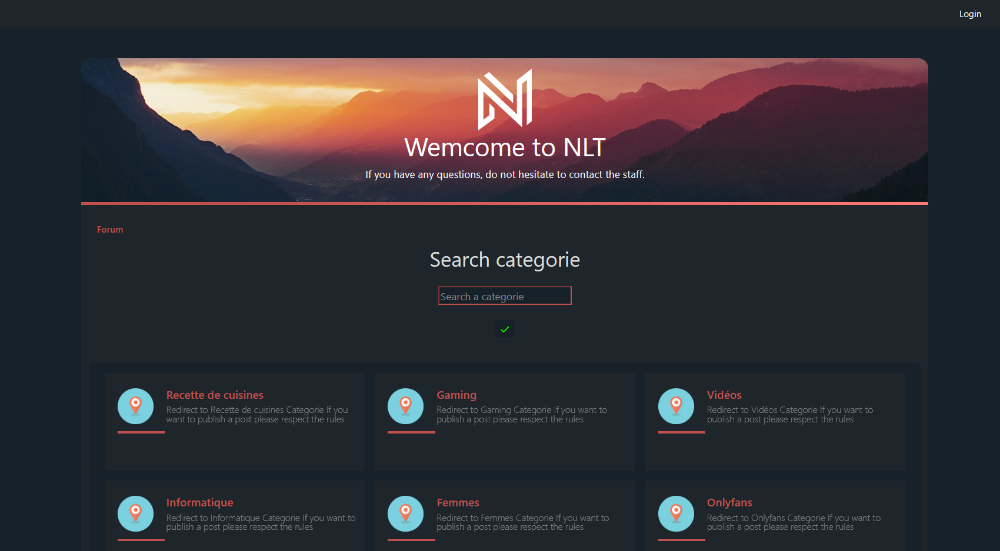

<h1 align="center">NLT Forum</h1>

 ## Join us now **[here](https://github.com/Luxchar?tab=repositories)** !
 

<h1 align="center">Quick Rundown of all the functionalities:</h1>

    - Authentification
      > Register/Log in
      > Log out
      > Smtp check admin mail by sending him a confirmation

    - Communication between users.
      > Post to various categories
      > Reply to users comments **and** posts !
      > Delete your own comments
      
    - Filtering posts.
      > Searchbar to filter through categories
      > Categories to post to
      > A page for each category to search for a topic
      
    - Security
      > Password Encryption
      > Cookies
      > Ratelimiting
      > hosted on an HTTPS website 
      
    - Moderation
      > Moderators and Administrators (different level of permission)
      > Admin Panel:
        1. Create a user
        2. Create a category
        3. Send an alert to every user mail
        4. Query through the database easily
      > Delete users posts
        
    - Profile handling
      > Set a description for your profile
      
    - And more..
      > CLI interface for setting up your own brand new database
      > Backing up your database
